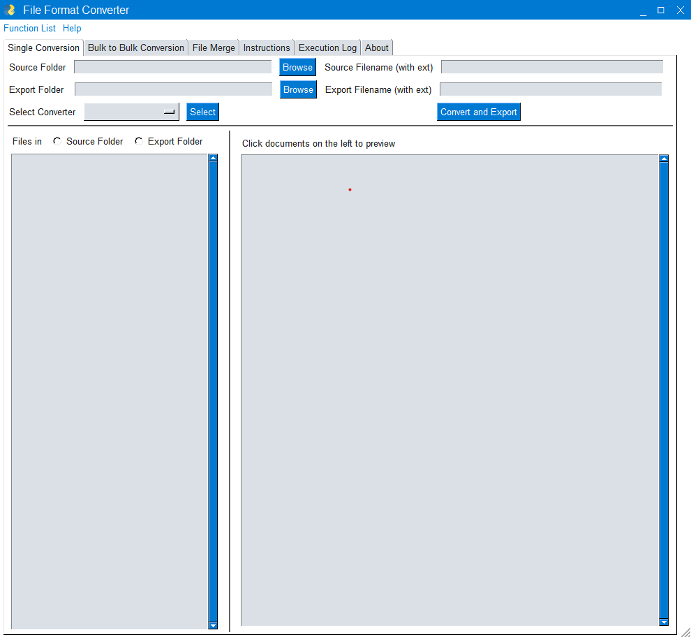
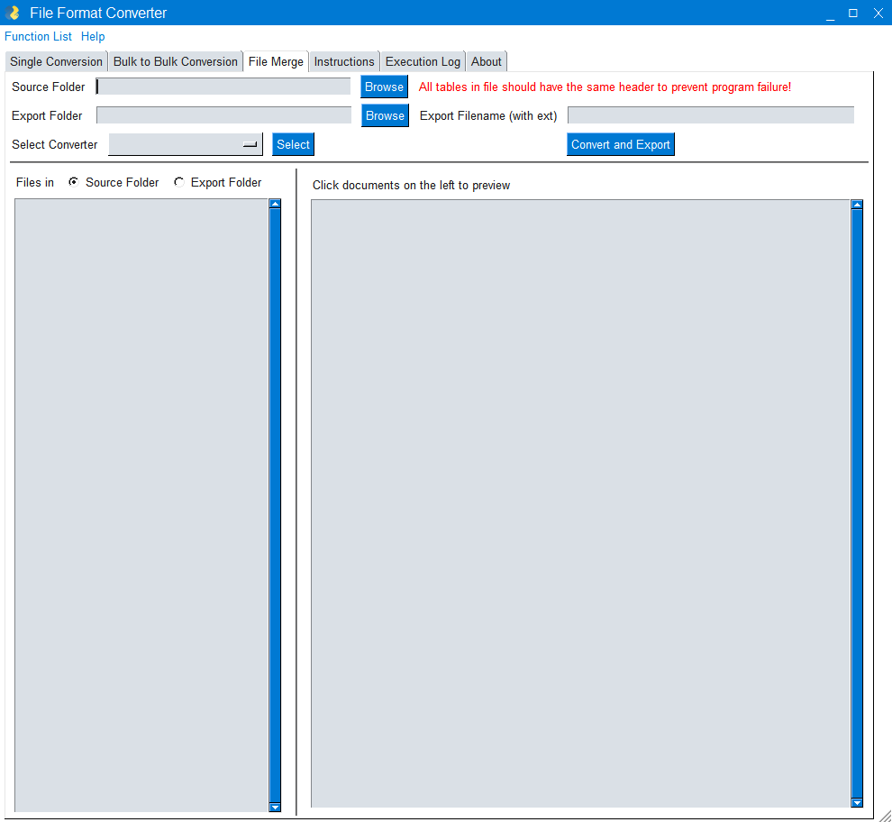

# File Format Converter for Data Manipulation and AI Training (FFC)

<!---->

<!--Please check my GitHub page for the latest info!-->

## Table of Content
- General User Section
   - [Description](#description)
   - [Instruction](#instruction)
   - [Developing Environment](#developing-environment)
- Coder Section
   - [Program Structure](#program-structure)
   - [Repository Structure and Description](#repository-structure-and-description)
   - [Functionality Development Process](#functionality-development-process)
   - [Troubleshoot](#troubleshoot)
   - [Bug](#bug)
   -  [Possible Improvement](#possible-improvement)

<!--General User-->

## Description
This program aims to provide easy and offline access to convert various file types to other file types.

Developed Usage:
1. Transfer XML files generated from labelImg, which specifies the selected region coordinate of pictures, and turn them into CSV files for further processing.
2. Renaming many files with only a few clicks can significantly decrease the time needed when generating AI training files.
3. Able to convert between markdown, CSV, and Parquet files is extremely useful for data management since my current data is managed with Obsidian, which is suitable for viewing data but not managing them.

## Instruction
1. Single Conversion:
        This tab allows you to convert a single file from one file type to another.
    Operation Steps:
   1. Select the source folder.
   2. Select the export folder.
   3. Select the converter.
   4. Click the select button.
   5. Select the source file name with file extension included.
   6. Select the export file name with file extension included.
   7. Click the convert and export button.
2. Bulk to Bulk Conversion:
        This tab allows you to convert all specified types of files in one folder to another.
    Operation Steps:
   1. Select the source folder.
   2. Select the export folder.
   3. Select the converter.
   4. Click the select button.
   5. For the "File Rename" converter, an additional source file type and export filename initial number are required. 
       **Source Filetype**: The filetype of the source files that you intended to rename. Example: ".xlsx", ".csv", ".txt", etc. 
       **Export Filename Initial Number**: The initial number of the export filename. All the files are renamed with an incremental number based on the initial number. Example: "1", "1001", "100001", etc.
   6. Click the convert and export button.
3. File Merge:
   This tab allows you to merge multiple files into a single file.
   1. Select the source folder.
   2. Select the export folder.
   3. Select the converter.
   4. Click the 'Select' button.
   5. Click the 'Convert and Export' button.
4. Execution Log:
   This tab provides a log for every operation the user performs and is used to track back errors.
5. Instructions:
   Provide instructions on using this program.
6. About:
   This tab provides information about the program.

## Developing Environment
- Windows 11
- Python 3.10.4
    - numpy == 1.23.0
    - pandas == 1.4.3
    - PySimpleGUI == 4.60.1

<!--Coder-->

## Program Structure
- ffc.py
  - event_handler_function.py
    - converter_functions.py
  - gui_layout.py

## Repository Structure and Description
- .github/ISSUE_TEMPLATE
  - ISSUE_TEMPLATE
    - bug_report.md
    - custom.md
    - feature_request.md
   - workflows
     - checkmarx.yml
     - codacy.yml
     - codeql-analysis.yml
     - dependency-review.yml
- .gitignore: File types not included in this repo.
- CONTRIBUTING.md: What to do if you want to contribute.
- LICENSE: MIT license detail.
- README.md: Introduction to this repo.
- converter_functions.yp: Store all the functions beside GUI.
- event_handler_function.py: GUI and function execution.
- ffc.py: Workflow.
- gui_layout.py: 
- requirements.txt: List of python library can be used to install them. "$ pip install -r python_library_requirement.txt"

## Functionality Development Process
- [ ] FFC Program
  1. [ ] Single Conversion
     1. [x] GUI Layout
     2. [x] GUI Event Handling
     3. [x] Conversion Algorithm
     4. [ ] Operation Rule
  2. [ ] Bulk to Bulk Conversion
     1. [x] GUI Layout
     2. [x] GUI Event Handling
     3. [x] Conversion Algorithm
     4. [ ] Operation Rule
  3. [ ] File Merge
     1. [x] GUI Layout
     2. [x] GUI Event Handling
     3. [x] Conversion Algorithm
     4. [ ] Operation Rule
- [x] Conversion Algorithm
  - [x] Single Conversion
    1. [x] MD to CSV
    2. [x] CSV to MD
    3. [x] XML to CSV
    4. [x] CSV to Parquet
    5. [x] Parquet to CSV
    6. [x] Rename
  - [x] Bulk to Bulk Conversion
    1. [x] MD to CSV
    2. [x] CSV to MD
    3. [x] XML to CSV
    4. [x] CSV to Parquet
    5. [x] Parquet to CSV
    6. [x] Rename
  - [x] File Merge
    1. [x] CSV
    2. [x] Parquet
    3. [x] MD
    4. [x] XML to CSV

*MD: Markdown files that contain only one table. 
*XML: XML files generated from labelImg.

## Troubleshoot
1. Convert and Export: Please select converter. 
   Problem: Button 'Convert and Export' in the tab 'Single Conversion' doesn't work even if all names and directories are correct. 
   Fix: Try to install the python package 'pyarrow'.

## Bug
1. **ListBox -> Program Freeze.** 
   *Problem:* Click on the list box in the tab 'Single Conversion' before selecting any directory will cause it to freeze. 
   *Status:* Unsolved.
2. **Window -> Always on top.** 
   *Problem:* The entire FFC window is always displayed on top of every other window. 
   *Status:* Fixed.
3. **Select -> Program Freeze.** 
   *Problem:* Click 'Select' in tab 'Single Conversion' before 'Export Filename' was input causing it to freeze. 
   *Status:* Unsolved.
4. **Bulk to Bulk CSV to Parquet -> Parquet file can't be previewed.** 
   *Problem:* When doing the above-mentioned process, those CSV files' table contains not only the numbers that would result like this. 
   *Status:* Unsolved.

## Possible Improvement
1. Rewrite the validating mechanism of the tab 'Single Conversion'.
2. Add validating mechanism to the tab 'Bulk to Bulk Conversion'.
3. Add a progress bar in the tab 'Bulk to Bulk Conversion'.
4. Add multiprocessing feature to the tab 'Bulk to Bulk Conversion'.
5. Refresh the window when 'Convert and Export' is processing.
6. Add JSON Converter.
7. Add AVRO Converter.